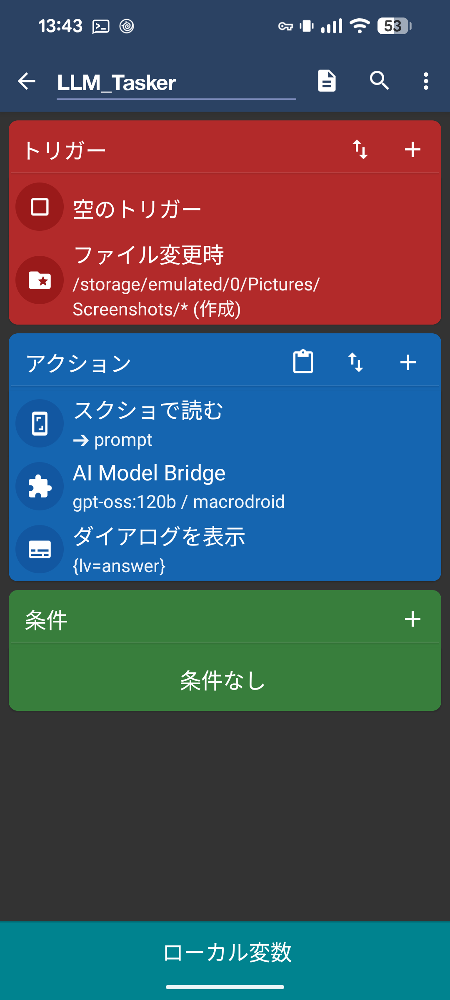

# Ollama Tasker Bridge

AndroidアプリからローカルGGUFモデルを実行し、Ollama Cloud/ServerとTasker・MacroDroidを連携するプロジェクトです。

## 構成

- `app`: Android UI、モデル管理、Ollama通信、Tasker/MacroDroid連携
- `lib`: Arm AI Chatを基にしたllama.cpp JNIとCPU推論層
- `third_party/llama.cpp`: llama.cpp submodule

## ビルド

```bash
./gradlew clean assembleDebug
```

主対象ABIは`arm64-v8a`です。GGUFモデルはアプリのprivate storageへ保存し、`lib`の共通推論層からUIと自動化経路の両方が利用します。

MacroDroidの結果受信は[設定手順](docs/MACRODROID_RESULT.md)を参照してください。

MacroDroidの設定資料:
- [1つのマクロで実行する手順](docs/MACRODROID_ONE_MACRO.md)
- [結果変数の受け取り](docs/MACRODROID_RESULT.md)
- [Intent送受信の互換手順](docs/MACRODROID_INTENT.md)

## 画面例

実機のMacroDroidマクロ設定例です。Tasker/Locale Pluginでプロンプトを渡し、完了後に`%answer`をMacroDroid変数へマッピングできます。



## ライセンス

プロジェクト固有部分はMIT Licenseです。`lib`に含まれるArm AI Chat由来コードの原文ライセンスは[LICENSES/ARM-AI-CHAT-LICENSE.txt](LICENSES/ARM-AI-CHAT-LICENSE.txt)に保存しています。第三者コードの権利表示は[NOTICE](NOTICE)を参照してください。
